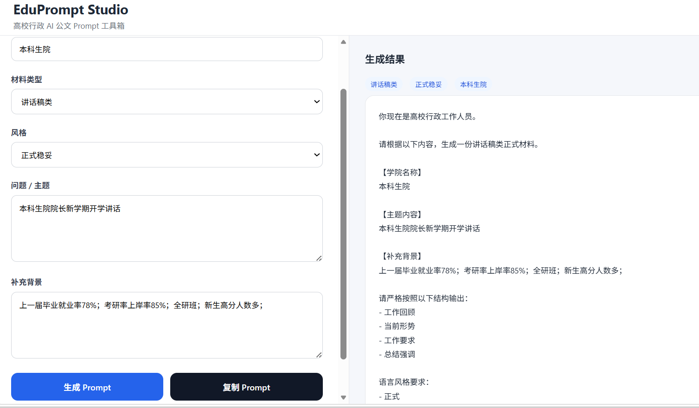

<div align="center">

# EduPrompt Studio

**高校行政 AI 公文 Prompt 工具箱**

让高校行政岗的同事，30 秒内为 ChatGPT / Claude / DeepSeek 写出一条专业、合规、能直接复制使用的 Prompt。

[](./LICENSE)
[](https://chateldonko.github.io/EduPromptStudio/)
[](./CONTRIBUTING.md)


[🚀 在线体验](https://chateldonko.github.io/EduPromptStudio/) · [📚 案例库](./docs/cases/) · [📥 贡献新模板](./CONTRIBUTING.md) · [💬 提建议](https://github.com/chateldonKo/EduPromptStudio/issues/new/choose)

[](https://afdian.com/a/EduPromptStudio)



</div>

---

## 这是什么

EduPrompt Studio 是一个**纯前端、零部署、零账号**的 Prompt 生成器，专门面向高校行政办公场景。

你只需要填几个空（学院、主题、背景），它会按公文场景的固定结构，输出一段结构化、带语气约束、带表达禁区的 Prompt——粘贴到任意大模型里，就能拿到一篇可用的初稿。

> ⚠️ 本工具**只生成 Prompt**，不直接调用 AI、不存储用户数据；正式发文请务必人工审核。

## 适合谁

| 适合 ✅ | 不适合 ❌ |
| --- | --- |
| 高校学院/部门行政干事、辅导员、教学秘书 | 期望工具直接出最终成稿（仍需大模型 + 人工） |
| 第一次用 AI 写公文、不会写 Prompt 的老师 | 涉密、涉敏、需走机要流程的材料 |
| 想沉淀本部门"标准提问模板"的科室 | 已有完整 SOP 与定制化 prompt 工程的团队 |

## 支持哪些公文类型

当前覆盖 9 类高频材料，对应 `data/templates/` 下的 9 个 JSON 文件。每类都有真实场景案例，在 [docs/cases/](./docs/cases/) 里：

| 分类 | 适用场景 | 案例 |
| --- | --- | --- |
| 🛠 整改类 | 检查、巡视、审计、督导后的整改回应 | [→](./docs/cases/rectification.md) |
| 📊 总结汇报类 | 年度 / 学期 / 项目结项 / 专项总结 | [→](./docs/cases/summary.md) |
| 📐 方案类 | 工作方案、活动方案、实施细则 | [→](./docs/cases/implementation.md) |
| 🏷 项目申报类 | 教改项目、平台建设、专项经费申报 | [→](./docs/cases/project.md) |
| 🔍 调研分析类 | 专题调研、现状摸底、问题分析 | [→](./docs/cases/research.md) |
| 📝 会议纪要类 | 党政联席会、院务会、专题会 | [→](./docs/cases/meeting.md) |
| 📢 通知说明类 | 对内/对外通知、说明、提醒 | [→](./docs/cases/notice.md) |
| 🎤 讲话稿类 | 大会、动员会、座谈会、颁奖会讲话 | [→](./docs/cases/speech.md) |
| 🎓 教学认证类 | 工程教育认证、师范专业认证、审核评估 | [→](./docs/cases/accreditation.md) |

新增模板？只需提交一个 PR → 在 `data/templates/` 里加一个 JSON 文件，详见 [CONTRIBUTING.md](./CONTRIBUTING.md)。

## 快速上手

### 方式 A：直接用线上版（推荐）

<https://chateldonko.github.io/EduPromptStudio/>

打开即用，无任何依赖。

### 方式 B：本地运行

模板拆成了独立 JSON，浏览器在 `file://` 协议下不允许读取本地 JSON，所以**不能直接双击 `index.html`**，请用任一本地服务器：

```bash
git clone https://github.com/chateldonKo/EduPromptStudio.git
cd EduPromptStudio

# 任选其一启动一个本地服务器
python -m http.server 8000        # Python 3
npx serve .                       # Node.js
php -S localhost:8000             # PHP
```

然后访问 <http://localhost:8000>。

## 项目结构

```
EduPromptStudio/
├── index.html              # 主页面（含 SEO meta、UI、逻辑）
├── favicon.svg             # 站点图标
├── data/templates/         # 9 个模板 JSON + index.json 清单
├── assets/demo.png         # 演示截图
├── docs/
│   ├── cases/              # 9 类公文的真实案例（输入 + Prompt + AI 输出）
│   ├── growth-playbook.md  # 增长手册（小红书/公众号/知乎/导航站）
│   └── analytics.md        # 隐私友好的访问统计接入指南
├── .github/
│   ├── ISSUE_TEMPLATE/     # Issue 模板（Bug / 功能 / 新模板）
│   └── PULL_REQUEST_TEMPLATE.md
├── CONTRIBUTING.md
├── CODE_OF_CONDUCT.md
├── CHANGELOG.md
├── LICENSE                 # Apache-2.0
└── README.md
```

## 模板 JSON 字段说明

每个模板是一份独立 JSON：

```json
{
  "id": "rectification",
  "name": "整改类",
  "icon": "🛠",
  "description": "用于被上级检查、巡视、审计、督导后形成书面整改回应。",
  "structure": ["问题情况", "原因分析", "整改措施", "长效机制"],
  "tone":      ["正式", "稳妥", "克制"],
  "forbidden": ["极其严重", "完全失败", "恶劣影响"],
  "examples": {
    "topic": "毕业设计抽检不合格整改",
    "background": "学校开展本科毕业设计专项检查，发现部分材料不规范"
  }
}
```

| 字段 | 必填 | 说明 |
| --- | :---: | --- |
| `id` | ✅ | 英文 ID，与文件名一致 |
| `name` | ✅ | 中文显示名 |
| `icon` | ⛔ | 一个 emoji，用于下拉框前缀 |
| `description` | ✅ | 一句话场景说明 |
| `structure` | ✅ | 强约束的输出段落结构 |
| `tone` | ✅ | 语气词约束 |
| `forbidden` | ✅ | 禁用表达列表（避免 AI 输出夸张套话） |
| `examples` | ⛔ | "填入示例数据"按钮使用的样例 |

新增模板后，同时在 `data/templates/index.json` 的 `templates` 数组末尾追加 `id` 即可。

## 路线图

- [x] 9 类常见公文 Prompt 模板
- [x] SEO / 社交分享卡片 / favicon
- [x] 模板数据化（JSON）便于社区贡献
- [x] 仓库规范化（Issue / PR / Contributing）
- [x] 案例库：每个模板配真实输入与 AI 输出示例
- [x] 增长手册（小红书 / 公众号 / 知乎话题 / 导航站投递清单）
- [x] 埋点接入指南（Umami / Plausible / GoatCounter）
- [ ] 用户输入 localStorage 持久化 + 历史记录
- [ ] 一键导出 `.md` / `.txt`
- [ ] 模板子类型（如「总结」拆分为 年度/学期/党建/结项）
- [ ] 字数 / 受众 / 是否含数据等参数化字段
- [ ] PWA：可"安装到主屏 + 离线使用"

## 贡献

非常欢迎你贡献新模板！不需要懂 JavaScript，只需要会写 JSON。

- 🐛 [报告 Bug](https://github.com/chateldonKo/EduPromptStudio/issues/new?template=bug_report.yml)
- 💡 [提交新模板需求](https://github.com/chateldonKo/EduPromptStudio/issues/new?template=template_request.yml)
- 🚀 [提交新功能想法](https://github.com/chateldonKo/EduPromptStudio/issues/new?template=feature_request.yml)
- 📥 提交 PR：详见 [CONTRIBUTING.md](./CONTRIBUTING.md)

参与项目即视为你同意遵守 [CODE_OF_CONDUCT.md](./CODE_OF_CONDUCT.md)。

## FAQ

**Q：会上传我的数据吗？**
A：不会。本项目是纯前端静态站点，所有输入仅在你自己的浏览器内拼接成字符串，不发任何请求到任何服务器。

**Q：和直接问 ChatGPT 有什么区别？**
A：通用 AI 不知道高校公文的"段落结构 / 语气尺度 / 禁用表达"。本工具帮你把这些隐性规范写进 Prompt，让 AI 一次到位，少改几轮。

**Q：需要付费 / 注册 / API Key 吗？**
A：都不需要。生成完 Prompt 后，自己粘贴到任何 AI 工具里就行。

**Q：可以二次开发并部署到我们学校内网吗？**
A：可以。本项目使用 Apache-2.0 协议，保留版权声明即可商用、改用、内网部署。

## Star History

如果这个工具帮到你，欢迎点一下 Star，这是对独立开发者最大的鼓励。

[](https://star-history.com/#chateldonKo/EduPromptStudio&Date)

## License

[Apache License 2.0](./LICENSE) © chateldonKo

## 🙏 支持项目

EduPromptStudio 完全免费开源，持续维护需要动力。

如果这个工具帮你省下了写材料的时间，欢迎请作者喝杯咖啡 ☕

<a href="https://afdian.com/a/你的用户名">
  
</a>

也欢迎直接 ⭐ Star 本项目，是对作者最直接的鼓励。

### 致谢赞助者

<!-- 机构赞助（¥99档）的单位名称将显示在这里 -->
感谢所有支持者，你们的名字将出现在这里 🎉
